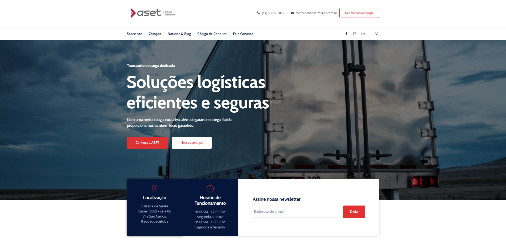
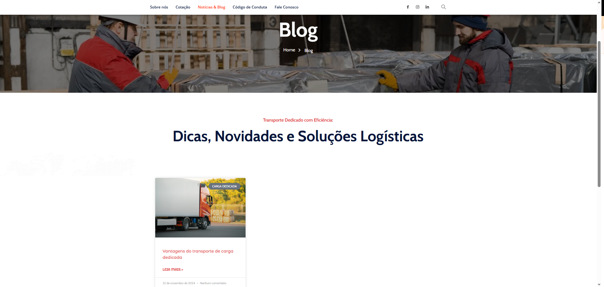

# 🌐 Site Institucional – Aset Carga Dedicada

Este repositório apresenta o desenvolvimento do **site institucional completo da empresa Aset Carga Dedicada**, especializada em transporte rodoviário de cargas rastreadas. O site foi desenvolvido com foco em apresentar os serviços da empresa de forma clara, objetiva e responsiva, utilizando **WordPress + Elementor**.

## 🧰 Tecnologias Utilizadas

- WordPress
- Elementor (Page Builder)
- Plugins de formulário de contato
- Otimização responsiva (mobile/tablet/desktop)
- Hospedagem e domínio personalizado

## 🎯 Objetivos do Projeto

- Criar uma presença digital institucional para a Aset Carga
- Apresentar os diferenciais e serviços de forma simples e confiável
- Facilitar o contato direto com a empresa
- Transmitir profissionalismo através de um design limpo e funcional

## 🖼️ Capturas de Tela

| Seção | Imagem |
|-------|--------|
| Página Inicial |  |
| Sobre a Empresa |  |
| Blog |  |
| Código de Conduta |  |
| Contato |  |

## 🌐 Acesse o Site ao Vivo

🔗 [Clique aqui para visitar o site](https://asetcargadedicada.com)

## 💡 Aprendizados e Destaques

- Entendimento do processo de desenvolvimento de um site institucional completo
- Personalização visual com foco na identidade da empresa
- Organização de conteúdo para facilitar a navegação e conversão
- Experiência prática com WordPress e Elementor como ferramentas de entrega

## 📫 Contato

Desenvolvido por Helena Peres  
📩 helenaperesdev@gmail.com  
🔗 [GitHub](https://github.com/HelenaPeres) | [LinkedIn](https://linkedin.com/in/helena-peres)
